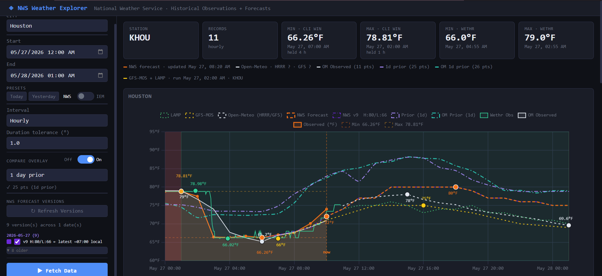
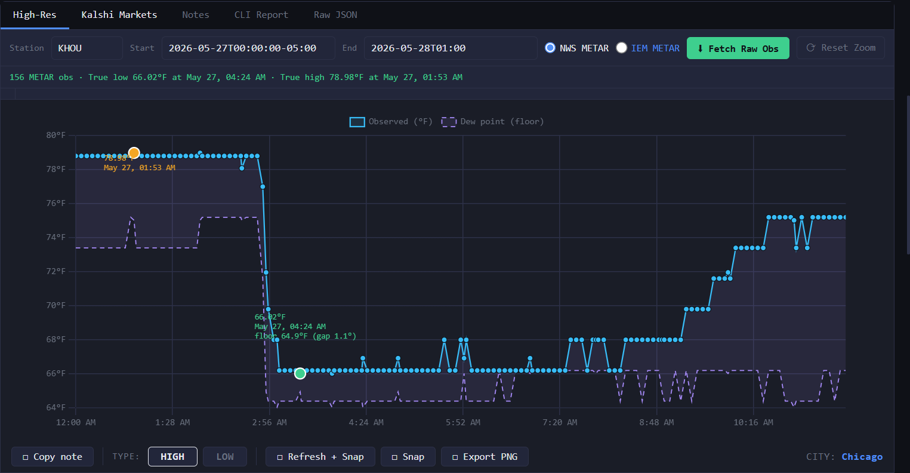
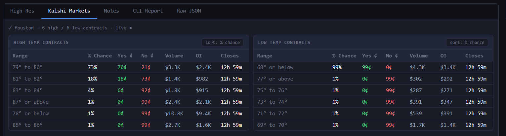
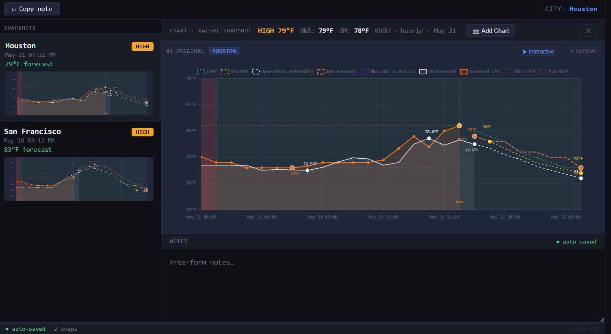
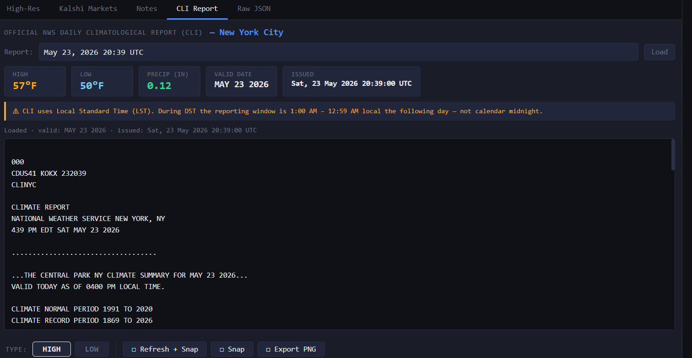

# Weather Forecast Dashboard

A Flask web app for cross-referencing multi-source weather forecasts against Kalshi prediction market contract prices to identify mispricings.



## What it does

Pulls temperature data from 5 independent sources, overlays them on a single chart, and streams live Kalshi contract prices — so you can see at a glance whether the market is pricing a high or low that no forecast model supports.

- **20 US cities** with per-city ASOS station mapping for accurate CLI settlement data
- **13 forecast sources**: NWS gridpoint, Open-Meteo HRRR→GFS, MOS (GFS-MOS + LAMP)
- **Live Kalshi contract stream** via WebSocket — bid/ask spread updated in real time
- **High-resolution mode** — raw METAR/SPECI observations without hourly resampling, so you see every condition-triggered report
- **CLI daily reports** — the official NWS report that Kalshi contracts settle against, with the exact reporting window (DST-aware: 01:00–00:59 vs 00:00–23:59)
- **Period comparison** — overlay any prior period on the current chart for year-over-year or day-over-day context
- **Chart snapshots** — save the full underlying time series (observed, all forecast models, Kalshi prices) alongside a PNG; replay any snapshot as a live interactive chart later
- **Series toggling** — show or hide any individual forecast or observation series directly on the chart to isolate the lines you care about
- **Notes panel** — annotate observations inline and persist them across sessions

## How to use it

### Finding mispricings
1. Select a city and date range
2. Load all forecast sources — if NWS, Open-Meteo, and MOS all cluster around 78°F for a daily high but the Kalshi market is pricing 75°F, that's a potential edge
3. Cross-reference with the CLI report to confirm what the settlement temperature actually was on past dates

### High-res mode
Standard mode resamples observations to hourly intervals. High-res mode shows every raw METAR and SPECI report — useful when a temperature spike lasts less than an hour and would otherwise be smoothed out.

High-res mode also plots the dew point alongside each observation. Since air temperature cannot fall below the dew point — condensation begins at that threshold and the latent heat release prevents further cooling — the dew point gives you a lower bound on how far the overnight low can realistically drop.



### Kalshi contract panel
Streams live bid/ask prices for daily high and low temperature contracts. Shows the implied settlement temperature alongside the forecast overlay so you can see the spread at a glance.



### Chart snapshots
Snapshots save the full underlying data — all observed and forecast time series, Kalshi contract prices, and chart settings — alongside a PNG capture. You can flip any saved snapshot back to an interactive chart, toggle individual series on/off, and re-examine the data exactly as it was when you took the snap.

Additional charts can be appended to an existing snapshot (e.g. after refreshing data or switching cities), so you can compare multiple states side by side within a single note.

### Notes


Each snapshot includes a free-form notes field for documenting your reasoning — why the market looked mispriced, what the forecasts were saying, any caveats. Notes auto-save as you type and persist across sessions.

You can also append additional chart captures to an existing note at any time (e.g. after the day resolves and you want to record what actually happened), building a before/after record within a single snapshot.

### CLI reports
NWS publishes a daily CLI report with the official high/low for each city. This is what Kalshi contracts settle against — not raw observations. The app fetches the current report and lets you browse historical ones.

The reporting window is non-standard: during DST it runs 01:00–00:59 local (next day); during standard time it runs 00:00–23:59. The app handles this automatically.



## Setup

```powershell
pip install -r requirements.txt
```

Copy `.env.example` to `.env` and fill in your credentials:

```powershell
Copy-Item .env.example .env
```

Run the server:

```powershell
python server.py
# Open http://localhost:5000
```

## Environment variables

| Variable | Description |
|----------|-------------|
| `KALSHI_KEY_ID` | Kalshi API key UUID — from kalshi.com/account/api |
| `KALSHI_KEY_FILE` | Path to your Kalshi RSA private key PEM file |
| `WETHR_API_KEY` | wethr.net API key for live observation stream |

Kalshi and wethr credentials are optional — the app runs without them, those panels just show as unavailable.

## Data sources

| Source | Type | What it provides |
|--------|------|-----------------|
| **NWS** (`api.weather.gov`) | Observed + forecast | Hourly ASOS observations, gridpoint hourly forecast, official CLI daily reports |
| **IEM** (Iowa Environmental Mesonet) | Observed | More complete ASOS archive — includes SPECIs that NWS occasionally drops; used for high-res mode and as NWS fallback |
| **Open-Meteo** | Forecast | HRRR (first ~18 hrs, 3 km resolution) → GFS handoff; independent from NWS pipeline |
| **MOS** (via IEM) | Forecast | Statistically bias-corrected GFS output; GFS-MOS (4x/day, 7-day) and LAMP (hourly, 38-hr) |
| **Kalshi** | Prediction market | Live contract prices for daily high/low temperature markets; streamed via WebSocket |
| **wethr.net** | Observed (live) | Real-time observation stream |

## Cities supported

20 US cities: New York City, Chicago, Los Angeles, Houston, Miami, Seattle, Denver, Boston, Atlanta, Phoenix, Dallas, Philadelphia, San Francisco, Minneapolis, Las Vegas, Oklahoma City, Austin, Washington DC, San Antonio, New Orleans
